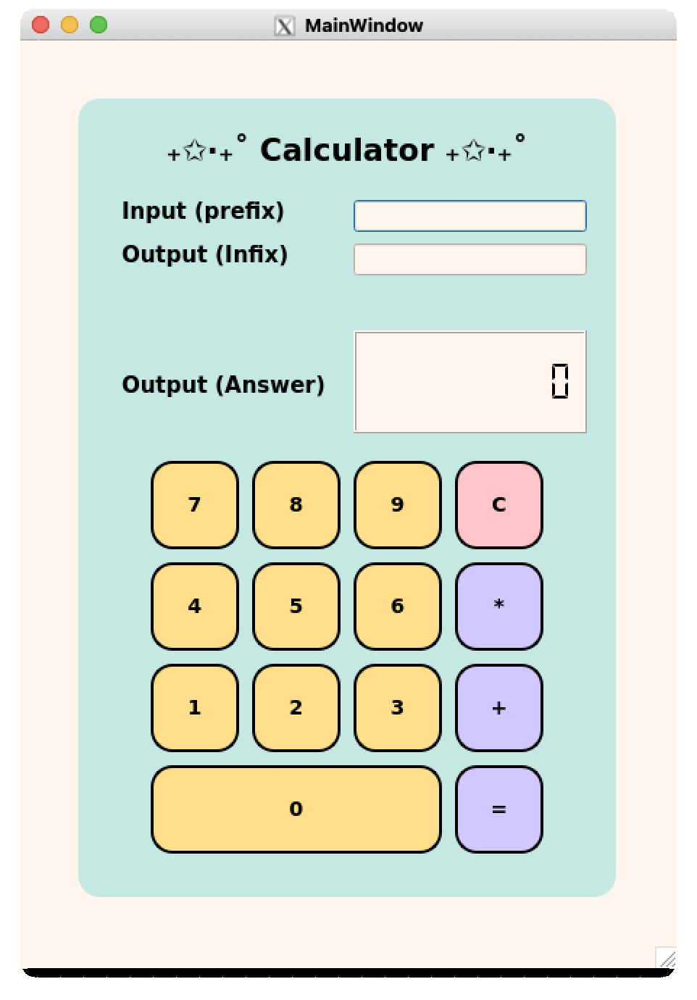

# ₊✩‧₊˚ PLC Calculator ₊✩‧₊˚
- **By : Tatiya Seehatrakul st124875**
- This project is developed to fulfill the requirements of the AT70.07 Programming Languages and Compilers course at the Asian Institute of Technology (AIT) for the January 2025 semester.

  

### 📍 Pre-requisites 
- Python 3.9.18
- PDM for managing project 
- PyQt6 for GUI development

### 📍 Run on Docker
1. Install `Docker Desktop`
2. Click `Use this template` on the top right of this page to clone this to repository.
3. Clone the project to local machine.
4. Install X11Client to use GUI in `Docker`. 
   - For `Windows`: [X410](https://x410.dev)
   - For `Mac`: [XQuartz](https://www.xquartz.org)
   - For `Linux`/`Ubuntu`: Simply map `DISPLAY`.
5. Open the project in `VSCode`. A prompt should appear stating, "Folder contains a Dev Container configuration file. Reopen folder to develop in a container." If this dialog is missed, the Dev Container can still be opened by pressing `Cmd/Ctrl` + `Shift` + `P` and searching for "Dev Containers: Rebuild and Reopen in Container."

### 📍 Run on Local Machine
1. Click `Use this template` on the top right of this page to clone this to repository.
2. Clone the project to your local machine.
3. Go to project folder and run `pdm install`.

### 📍 Run the Project.
After the project is cloned and all setup steps are completed, the project can be run using the command `pdm run app`.

### 📍 QT Designer GUI

- `PyQt6` and `Qt Designer 6` are used for the GUI.  
- To launch `Qt Designer` run:
    - `pdm shell pyqt6-tools designer`
    - `pdm run ui` or `pyqt6-tools designer main.ui`